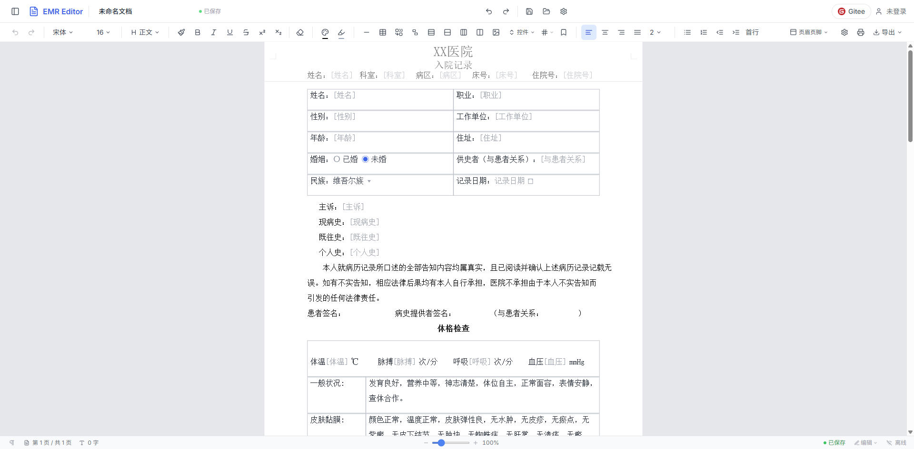

<div align="center">

# EMR 文档编辑器引擎

**专业、高性能、可嵌入的电子病历（EMR）文档编辑引擎**

[](http://139.196.151.15/)
[](LICENSE)
[](#参与贡献)
[](frontend/package.json)
[](frontend/package.json)
[](backend/pom.xml)

</div>

<div align="center">



**入院记录模板编辑实况**：A4 真实排版 · 页眉页脚 · 结构化表单控件（下拉 / 单选 / 日期 / 数值）

</div>

## 项目简介

EMR 文档编辑器引擎是一个面向医疗场景的电子病历文档编辑系统，提供从文档创建、结构化编辑、模板管理到质量控制的完整闭环。项目采用前后端分离架构：

- **前端**：基于自研 HTML5 Canvas 渲染引擎，实现高性能文档编辑与 A4 真实排版。
- **后端**：Spring Boot + MyBatis-Plus，提供 RESTful API、JWT 鉴权与 WebSocket 实时通信基础设施。
- **框架/平台无关运行时**：编辑器引擎通过 `EditorHost` 能力接口（文本 / 字体 / 渲染表面 / 视口 / 输入 / 平台六元组）解耦宿主环境，可嵌入 React、Vue、Electron、Web Worker 等任意宿主，引擎源码零浏览器全局依赖。

## 在线体验

无需本地部署，打开即可体验：

> **演示地址：[http://139.196.151.15/](http://139.196.151.15/)**

## 核心特性

### 专业文档编辑

- **富文本格式化**：加粗 / 斜体 / 下划线（单线、双线、波浪线）/ 删除线 / 上标 / 下标 / 字体 / 字号 / 文字颜色 / 高亮
- **段落排版**：左 / 中 / 右 / 两端对齐，有序与无序列表（多级缩进），标题层级，段落缩进
- **表格处理**：插入表格、单元格合并 / 拆分、行列增删、跨页表格表头重复
- **专业元素**：图片、分隔线（4 种样式）、分节符、页眉页脚、脚注、书签与交叉引用

### 结构化病历能力

- **表单控件**：文本框、多行文本、数字、下拉选择、日期、日期时间、复选框、单选框 8 类结构化控件
- **域代码**：页码、总页数、日期、时间、标题、作者、保存日期、打印日期 8 种动态域
- **数据校验**：表单元素的数据校验与必填项检查
- **质量检查（QC）**：内置 6 条质控规则（标题非空 / 正文非空 / 无连续空段 / 必填 SmartText / 最低字数 / 段落数区间），支持评分与分级展示

### 分页与渲染

- **真实排版**：还原 A4 纸张尺寸、页边距、方向与分页规则，支持打印预览
- **虚拟滚动**：仅渲染可视页面，长文档流畅滚动
- **增量排版**：脏区追踪与布局缓存，编辑后局部重排
- **公式渲染**：基于 KaTeX 的 LaTeX 公式支持

### 编辑体验

- **撤销 / 重做**：Command 模式驱动，33 种可撤销命令，500ms 输入自动合并
- **剪贴板**：复制 / 剪切 / 粘贴，支持「保留源格式 / 匹配目标格式 / 纯文本」三种粘贴模式
- **查找替换**：支持正则、全词匹配、大小写敏感，替换可撤销
- **自动保存**：IndexedDB 本地存储，3 秒防抖，保留最近 3 个版本，支持崩溃恢复
- **自动更正**：内置 25 条医疗缩写规则与中文标点配对
- **中文输入**：完整 IME 组合输入支持

### 文档全生命周期

- **模板系统**：公共 / 私有模板分类管理，一键套用
- **文档比对**：两版本文档差异可视化
- **版本管理**：历史版本记录与回溯
- **审计追踪**：操作日志（创建 / 编辑 / 删除 / 打印 / 导出 / 查看）全记录
- **权限管控**：基于角色的访问控制，支持批注与修改留痕
- **导入导出**：支持 JSON / TXT / HTML 导出，JSON / HTML / Markdown / XML 导入

> 另见文末的 [规划中（Roadmap）](#规划中roadmap)，了解 PDF / DOCX 导出、HarfBuzz 塑形、协同编辑等后续计划。

## 架构概览

```
┌─────────────────────────────────────────────────────────────┐
│                    浏览器（React 18 + TypeScript）              │
│  ┌─────────────────────────────────────────────────────────┐ │
│  │  UI 层：components / pages / store（Zustand）             │ │
│  ├─────────────────────────────────────────────────────────┤ │
│  │  平台实现层 platform/dom：Canvas / 剪贴板 / IndexedDB 等   │ │
│  ├─────────────────────────────────────────────────────────┤ │
│  │  编辑器引擎 engine/（框架 / 平台无关）                      │ │
│  │  document · layout · render · interaction · command       │ │
│  │  state · plugins · qc · security · loaders · i18n         │ │
│  └─────────────────────────────────────────────────────────┘ │
└─────────────────────────────────────────────────────────────┘
                             │  HTTP / WebSocket
┌─────────────────────────────────────────────────────────────┐
│                    Spring Boot 3.3 后端（Java 17）             │
│  Controller → Service → Repository → MySQL / Redis            │
│  Security(JWT) · WebSocket · Springdoc(Swagger)              │
└─────────────────────────────────────────────────────────────┘
```

编辑器引擎通过 `EditorHost` 六元组（`text` / `font` / `surface` / `viewport` / `input` / `platform`）注入宿主能力，浏览器能力经 `platform/dom` 注入引擎，使引擎保持框架与平台无关。

## 技术栈

| 层级 | 技术 |
|------|------|
| 前端框架 | React 18 + TypeScript（严格模式） |
| 构建工具 | Vite |
| 样式方案 | Tailwind CSS |
| 状态管理 | Zustand |
| UI 组件 | Radix UI + Lucide 图标 |
| 渲染引擎 | HTML5 Canvas 自研渲染器 |
| HTTP 客户端 | Axios |
| 实时协作 | Yjs + y-websocket（能力预留） |
| 公式渲染 | KaTeX |
| 后端框架 | Spring Boot 3.3（Java 17） |
| 数据访问 | MyBatis-Plus |
| 安全框架 | Spring Security + JWT |
| 实时通信 | WebSocket |
| 缓存 | Redis |
| 接口文档 | Springdoc OpenAPI（Swagger） |
| 数据库 | MySQL 8.0+（测试环境 H2） |
| 测试 | Vitest + Testing Library + Playwright |

## 快速开始

### 环境要求

- Node.js 18+
- Java 17+
- Maven 3.6+
- MySQL 8.0+（可选，也可使用内置 H2 测试环境）
- Redis（可选）

### 1. 准备数据库

```sql
CREATE DATABASE IF NOT EXISTS emr_editor
  DEFAULT CHARACTER SET utf8mb4
  DEFAULT COLLATE utf8mb4_unicode_ci;
```

### 2. 启动后端

编辑 `backend/src/main/resources/application.yml` 配置数据库连接：

```yaml
spring:
  datasource:
    url: jdbc:mysql://localhost:3306/emr_editor?useUnicode=true&characterEncoding=utf-8&serverTimezone=Asia/Shanghai&createDatabaseIfNotExist=true
    username: root
    password: ${DB_PASSWORD:root}
```

```bash
cd backend
mvn spring-boot:run
```

后端服务启动于 `http://localhost:8080`，Swagger 文档位于 `http://localhost:8080/swagger-ui.html`。

### 3. 启动前端

```bash
cd frontend
npm install
npm run dev
```

前端应用启动于 `http://localhost:3001`，开发服务器已配置 `/api` 与 `/ws` 代理到后端。

### 4. 生产构建

```bash
cd frontend
npm run build
```

### Docker 部署

```bash
docker-compose up -d
```

## 项目结构

```
EMRDocumentEngine/
├── backend/                    # 后端服务（Spring Boot）
│   └── src/main/java/com/emr/
│       ├── config/             # 配置（安全、WebSocket、MyBatis-Plus）
│       ├── controller/         # 控制器层
│       ├── service/            # 业务逻辑层
│       ├── entity/             # 实体类
│       ├── repository/         # 数据访问层
│       ├── dto/                # 数据传输对象
│       ├── util/               # 工具类
│       └── websocket/          # WebSocket 实时协作
├── frontend/                   # 前端应用
│   └── src/
│       ├── components/         # React 组件（editor/layout/panels/toolbar/...）
│       ├── engine/             # 编辑器引擎核心（框架/平台无关）
│       │   ├── document/       # 文档模型（ModelD 树 + NodePool）
│       │   ├── layout/         # 布局引擎（行断/分页/增量/虚拟视口）
│       │   ├── render/         # 渲染（三层 Canvas + 粒子系统）
│       │   ├── interaction/    # 交互（键盘/鼠标/IME/事件总线）
│       │   ├── command/        # 命令系统（撤销/重做）
│       │   ├── host/           # EditorHost 能力接口
│       │   ├── state/          # 状态管理
│       │   ├── plugins/        # 插件系统
│       │   ├── qc/             # 质量控制
│       │   ├── security/       # 安全（XSS 防护）
│       │   ├── loaders/        # 文档加载器
│       │   ├── i18n/           # 国际化
│       │   └── __tests__/      # 引擎单元测试
│       ├── platform/           # 宿主平台实现（DOM 能力注入 engine）
│       ├── pages/              # 页面组件
│       ├── services/           # API 服务
│       ├── store/              # 全局状态（Zustand）
│       └── lib/                # 工具函数
├── output/                     # 项目文档（调研/PRD/架构/UIUX/规格）
├── knowledge/                  # 知识库
├── docker-compose.yml          # Docker 编排配置
└── LICENSE                     # MIT 许可证
```

## 核心模块

### 前端编辑器引擎

- **DocumentModel**：文档数据模型，管理文档元素树与 NodePool
- **Draw**：Canvas 渲染器，负责元素可视化
- **TextMeasurer**：文本测量器，计算文字宽高
- **HistoryManager / CommandUndoRedoStack**：历史管理，支持撤销 / 重做
- **EventBus**：事件总线，处理组件间通信
- **KeyboardHandler / MouseHandler / IMEHandler**：输入事件处理
- **LayoutEngine**：排版引擎（行断 / 分页 / 增量 / 虚拟视口）
- **EditorHost**：平台能力边界（六元组），实现框架 / 平台无关

### 后端服务层

- **DocumentService**：文档业务逻辑处理
- **TemplateService**：模板业务逻辑处理
- **AuthService**：认证授权服务
- **AuditLogRepository**：审计日志数据访问

## 项目文档

- [调研报告](output/1-research.md) — 技术选型与竞品分析
- [产品需求文档](output/2-prd.md) — 功能需求与用户故事
- [架构设计文档](output/3-architecture.md) — 系统架构与技术方案
- [UI/UX 设计文档](output/4-uiux.md) — 界面设计与交互规范
- [技术规格说明书](output/5-spec.md) — 详细技术规格与任务分解

## 开发说明

### AI 辅助开发契约

本项目使用 AI 辅助开发。为约束 AI 的代码行为、确保架构边界不被破坏，仓库维护了一套「AI 编辑契约」：

- `.claude/CLAUDE.md`：AI 入口提示，指示 AI 在修改 `frontend/src/engine` 前必须先阅读契约。
- `.claude/AI_EDITOR_CONTRACT.md`：架构不变量契约，定义引擎的强制边界（引擎不得依赖 React 与浏览器全局、所有文档变更必须经过 Command 系统、每个可变事实必须有唯一 owner、文档模型不得依赖布局 / 渲染等）。

AI 在实现、重构、审查代码时，须将契约视为硬约束；如需打破某条不变量，必须先说明原因、评估影响并取得明确授权。

### 代码规范

- 前端使用 TypeScript 严格模式，提交前请运行 `npm run test`（Vitest）与 `npm run build`（含 `tsc --noEmit` 类型检查）
- 后端遵循阿里巴巴 Java 开发手册规范

## 规划中（Roadmap）

| 能力 | 说明 | 状态 |
|------|------|------|
| PDF / DOCX 导出 | 补齐导出能力 | 规划中 |
| HarfBuzz 文本塑形 | WASM 高精度文本测量 | 规划中 |
| 协同编辑接入 | Yjs / WebSocket 基础设施已就绪，编辑流接入 | 能力预留 |
| E2E 测试套件 | Playwright 端到端回归测试 | 规划中 |

## 参与贡献

首先，由衷地感谢你愿意为这个项目停下脚步、贡献一份力量。无论你是经验丰富的开发者，还是第一次接触开源的新朋友，你的每一条建议、每一行代码、每一次文档修订，对这个项目都弥足珍贵。

一个真正好用的电子病历编辑工具，离不开社区里每一位伙伴的共同努力。请放心大胆地参与进来——哪怕只是纠正一个错别字、提出一个「也许很傻」的问题，我们都会认真对待、心怀感激。

### 你可以如何参与

| 参与方式 | 适合人群 | 说明 |
|---------|---------|------|
| 报告 Bug | 所有使用者 | 描述问题现象、复现步骤与运行环境 |
| 提出建议 | 所有使用者 | 对功能、体验、文档的任何想法，都可以通过 Issue 告诉我们 |
| 提交代码 | 开发者 | 修复 Bug、实现新功能、优化性能，或补充单元测试 |
| 完善文档 | 所有人 | 改进 README、代码注释、设计文档 |
| 代码评审 | 开发者 | 帮忙 review PR、参与技术讨论 |

### 贡献流程

1. **先沟通，再动手**：先到 [Issues](https://gitee.com/wangwang_1_1665527118/emrdocument-engine/issues) 查看是否已有相关讨论；全新功能或较大改动请先开 Issue 说明想法。

2. **Fork 本仓库**：点击页面右上角 Fork 按钮。

3. **克隆到本地**：

   ```bash
   git clone https://gitee.com/你的用户名/emrdocument-engine.git
   cd emrdocument-engine
   ```

4. **创建功能分支**：

   ```bash
   git checkout -b feature/你的功能名
   ```

5. **开发并提交**：

   ```bash
   git add .
   git commit -m "feat: 新增 xxx 功能"
   ```

6. **运行测试与类型检查**：

   ```bash
   cd frontend
   npm run test    # 单元测试（Vitest）
   npm run build   # 类型检查与构建（tsc --noEmit）
   ```

7. **推送到你的分支**：

   ```bash
   git push origin feature/你的功能名
   ```

8. **发起 Pull Request**：回到 Gitee 页面发起 PR，清晰描述改动的目的与内容。

### 提交信息规范

遵循 [Conventional Commits](https://www.conventionalcommits.org/) 规范：

```
<类型>: <简短描述>

<可选的详细说明>
```

常用类型：

| 类型 | 用途 |
|------|------|
| `feat` | 新增功能 |
| `fix` | 修复 Bug |
| `docs` | 文档变更 |
| `refactor` | 代码重构（不改变功能） |
| `style` | 代码格式调整 |
| `test` | 补充测试 |
| `chore` | 构建、配置等杂项 |

例如：

```
feat: 表格编辑完整实现 — 单元格输入、块感知导航
fix: 修复多行文本光标寻址问题
```

### 社区守则

- **尊重他人**：观点不同很正常，就事论事、理性沟通
- **保持耐心**：维护者大多利用业余时间投入，回复可能需要一点时间
- **建设性地反馈**：指出问题时，尽量附带改进建议或具体场景

## 许可证

本项目基于 [MIT License](LICENSE) 开源协议。

## 联系方式

如有问题或建议，欢迎通过 [Issues](https://gitee.com/wangwang_1_1665527118/emrdocument-engine/issues) 页面反馈。

---

**感谢使用 EMR 文档编辑器引擎！**
